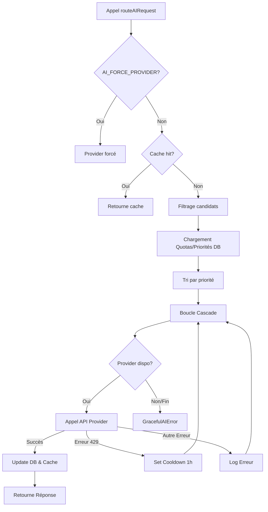

# AI Router — Documentation Technique

Ce document décrit le fonctionnement, l'architecture et la configuration du système de routage IA (AI Router) de Maïa.

## Vue d'ensemble

L'AI Router est un composant central de Maïa (`lib/ai-router.ts`) conçu pour garantir une haute disponibilité et une résilience maximale des fonctionnalités d'IA. Au lieu de dépendre d'un seul fournisseur, le router utilise une **architecture en cascade (fallback)** : si un fournisseur échoue (erreur 429, timeout, panne de service), le router bascule automatiquement sur le suivant selon une liste de priorités définie.

### Objectifs clés
- **Résilience** : Basculement automatique en cas de panne ou de limite de quota.
- **Optimisation des coûts** : Utilisation prioritaire de modèles moins chers ou gratuits (ex: Groq, Cerebras) avant de passer aux modèles premium (ex: Anthropic Claude).
- **Conformité** : Option pour forcer l'usage de serveurs situés en Europe (EU compliant).
- **Performance** : Mise en cache des réponses textuelles pour réduire la latence et les coûts.

---

## Architecture

Le système repose sur plusieurs composants :

1.  **Core Router** (`lib/ai-router.ts`) : La logique d'orchestration qui gère la cascade, le cache et les quotas.
2.  **Adapteurs (Providers)** (`lib/ai-providers/`) : Des implémentations standardisées pour chaque API (OpenAI, Gemini, Anthropic, Mistral, Groq, etc.).
3.  **Base de données (Supabase)** : Stocke l'état des quotas, les logs de requêtes et le cache des réponses.
4.  **Admin Page** (`app/admin/ai-router/page.tsx`) : Interface de monitoring et de gestion.

---

## Liste des Providers

| ID | Modèle | EU Compliant | Vision | Cas d'usage principal |
| :--- | :--- | :---: | :---: | :--- |
| `gemini_pro` | Gemini 2.5 Pro | ✅ | ✅ | Raisonnement complexe, gros documents |
| `gemini_flash` | Gemini 2.5 Flash | ✅ | ✅ | Extraction rapide, Vision |
| `mistral_large` | Mistral Large | ✅ | ❌ | Alternative souveraine performante |
| `anthropic_claude`| Claude 3.5 Sonnet | ❌ | ✅ | Qualité maximale, fallback Vision |
| `anthropic_haiku` | Claude 3.5 Haiku | ❌ | ✅ | Tâches simples, extraction rapide |
| `cerebras_llama` | Llama 3.1 70B | ❌ | ❌ | Latence ultra-faible |
| `groq_llama` | Llama 3.1 70B | ❌ | ❌ | Rapidité / Gratuité |
| `groq_gemma` | Gemma2 9B | ❌ | ❌ | Tâches légères |
| `sambanova_llama`| Llama 3.1 405B | ❌ | ❌ | Raisonnement complexe (Open Source) |
| `cloudflare_ai` | Llama 3.1 8B | ❌ | ❌ | Fallback ultime |

> **Note** : L'ID et la priorité sont gérés en base de données dans la table `ai_provider_quotas`.

---

## Flow d'une requête



1.  **Réception** : L'application appelle `routeAIRequest(taskType, prompt, options)`.
2.  **Cache** : Si la tâche n'est pas "Vision" et qu'un TTL est défini, on vérifie `ai_response_cache`.
3.  **Filtrage** : On élimine les providers ne correspondant pas aux critères (ex: `requireVision: true` ou `requireEuCompliant: true`).
4.  **Sélection** : On récupère les quotas depuis la DB. On exclut ceux en "cooldown" ou ayant épuisé leur quota journalier.
5.  **Exécution** : On essaie les providers par ordre de priorité croissante.
6.  **Gestion d'erreur** : Si un provider renvoie une erreur de type "Rate Limit" (429), il est mis en cooldown pour 1 heure en base de données.
7.  **Finalisation** : En cas de succès, on logue la latence/tokens et on met à jour le cache.

---

## Configuration

### Variables d'environnement
- `AI_FORCE_PROVIDER` : Si définie, force l'utilisation d'un provider spécifique (ex: `groq_llama`) pour tous les appels, bypassant la cascade et le cache.
- `SUPABASE_SERVICE_ROLE_KEY` : Nécessaire pour que le router puisse lire/écrire dans les tables de quotas et logs sans restriction RLS.

### RouteOptions (TypeScript)
```typescript
interface RouteOptions {
  systemPrompt?: string;
  pdfBase64?: string;
  requireVision?: boolean;    // Filtre les providers supportant la vision
  requireEuCompliant?: boolean; // Filtre les providers EU (Gemini/Mistral)
  model?: string;              // Force un modèle spécifique pour cet appel
  cacheTtlMs?: number;         // Durée de vie du cache (défaut 24h)
  jsonMode?: boolean;          // Force une réponse au format JSON
}
```

---

## Cache

Le cache (`ai_response_cache`) est basé sur un hash SHA256 du couple `(taskType, prompt)`.

- **Exclusion Vision** : Les tâches incluant un fichier (Vision) ne sont **jamais** mises en cache à cause de la taille des données et de la variabilité.
- **Expiration** : Par défaut, les entrées expirent après 24 heures. Un nettoyage aléatoire (1% de chance par requête) supprime les entrées expirées.
- **Hit Count** : Le nombre d'utilisations du cache est suivi pour mesurer l'efficacité.

---

## Quotas & Cooldowns

Le système d'auto-gestion des providers est stocké dans la table `ai_provider_quotas`.

- **Quotas Journaliers** : Chaque provider a un `daily_limit`. Le champ `requests_today` est réinitialisé automatiquement par le router lors de la première requête de la journée (`last_reset_at`).
- **Cooldown** : Lorsqu'un provider retourne une erreur 429 (Rate Limit), le router positionne `cooldown_until` à `Now + 1h`. Le provider sera ignoré par le router jusqu'à cette échéance.
- **Priorité** : Un entier (plus petit = plus prioritaire). Permet de favoriser les providers gratuits ou plus rapides.

---

## Modes d'échec

### GracefulAIError
Si tous les providers candidats échouent, le router lève une `GracefulAIError`. Cette erreur contient :
- La liste des providers tentés.
- Le type de tâche original.

L'UI ou l'API appelante peut ainsi capturer cette erreur pour afficher un message propre à l'utilisateur (ex: "Service temporairement indisponible").

---

## Page Admin

Accessible sur `/admin/ai-router`, elle permet aux administrateurs de :
- Visualiser l'état des quotas en temps réel (barres de progression).
- Voir quels providers sont actuellement en "cooldown".
- Consulter les 50 dernières requêtes (statut, latence, tokens, erreurs).
- Vider le cache des réponses.
- Surveiller le taux d'efficacité du cache (Cache Hits).

---

## Incohérences à adresser plus tard

- **Seed SQL vs Code** : Les providers Anthropic (`anthropic_claude`, `anthropic_haiku`) sont implémentés dans le code mais absents du script de migration SQL initial (`20260511000000_ai_router.sql`). Ils doivent être ajoutés manuellement en base pour être utilisés.
- **Versions des modèles** : Les noms de modèles comme `gemini-2.5-pro` ou `claude-sonnet-4-6` dans le code semblent être des placeholders ou des versions futures, à vérifier par rapport aux versions réellement disponibles (ex: `gemini-1.5-pro`, `claude-3-5-sonnet`).
- **Cache TTL** : Le code mentionne 24h dans les commentaires et le SQL, mais l'implémentation utilise `86_400_000` ms dans le code. C'est cohérent, mais la gestion du nettoyage est probabiliste (1%).
